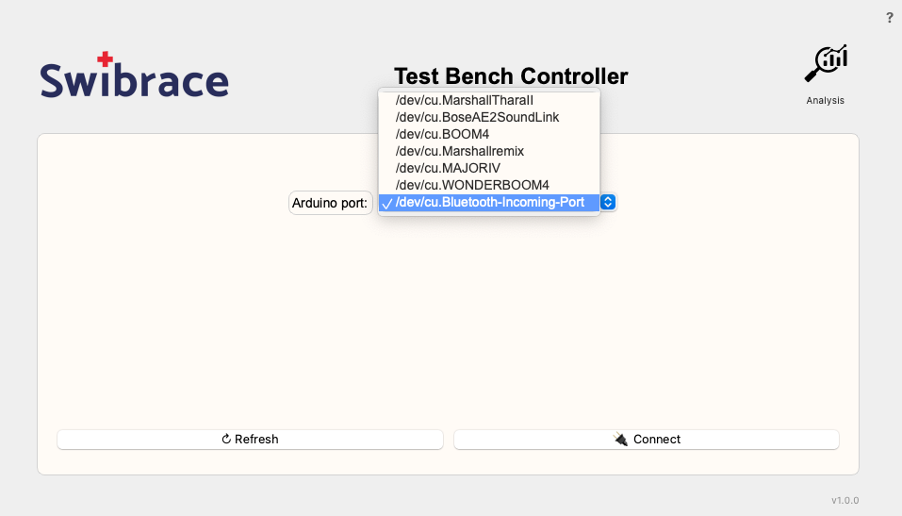
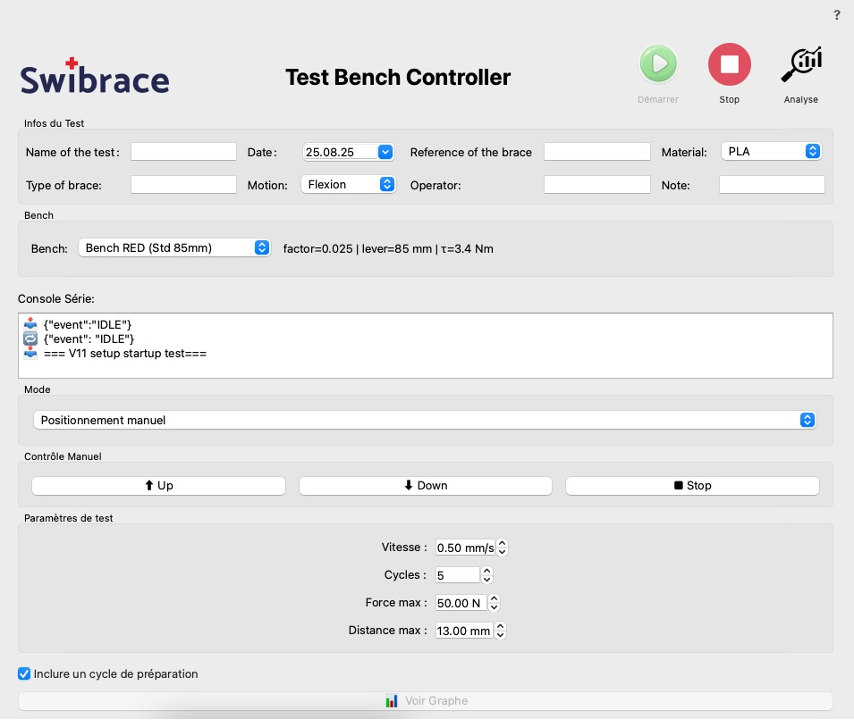
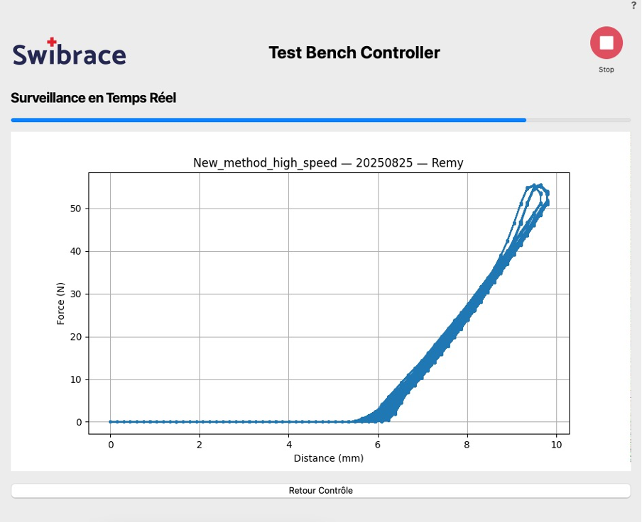
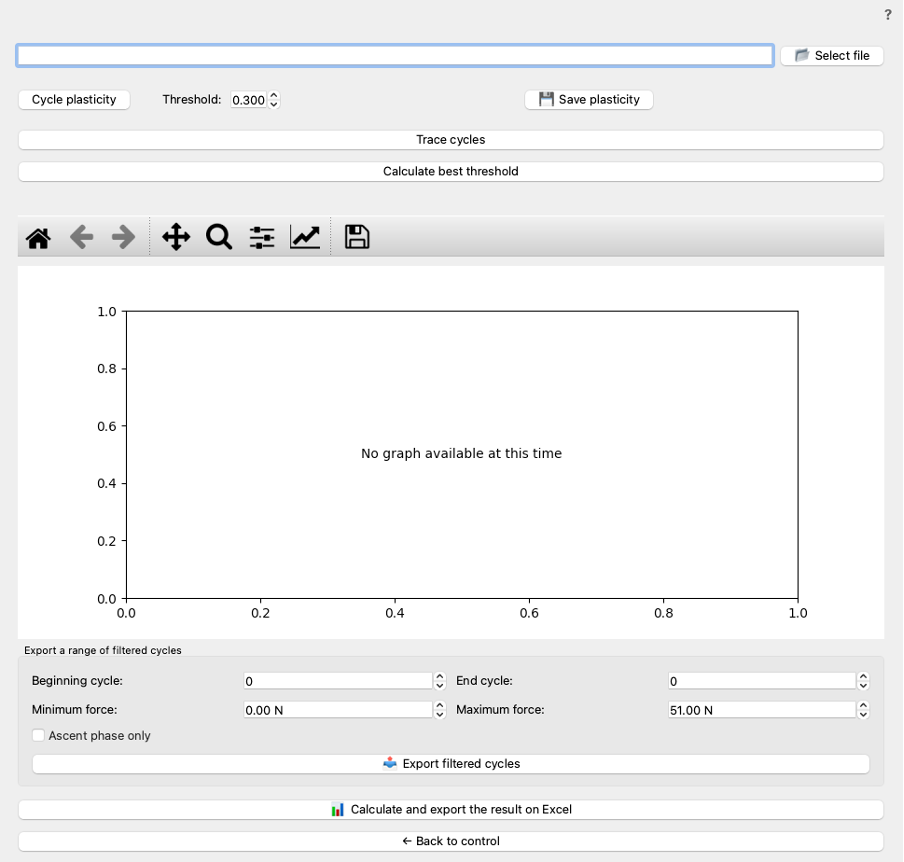

# 🛠️ Swibrace Bench Machine

A complete **force–displacement test bench** platform combining:

- **Arduino firmware** (deterministic motor + load cell acquisition, JSON/Binary protocol).  
- **Python Qt desktop app** (real-time control, monitoring, analysis, and Excel reporting).  

This project is used to test orthoses/braces under controlled conditions of **flexion/extension cycles**, logging **force vs. displacement** curves and producing structured Excel reports.

---

## 📸 Screenshots

| Port Selection | Control Panel | Monitor | Analysis |
|----------------|---------------|---------|----------|
|  |  |  |  |

---

## ✨ Features

- **Arduino firmware**  
  - Stepper control with acceleration ramps (Timer1 ISR).  
  - HX711 load cell acquisition with calibration.  
  - Finite State Machine (`IDLE`, `HOMING`, `DESCENDING`, `RETURNING`, …).  
  - Serial protocol: JSON commands + binary streaming frames.  
  - Safety: hardware stop byte (`0xFF`), homing switch, max force/distance limits.

- **Python GUI (PySide6)**  
  - **Port Selection** → connect to Arduino, handshake `READY`.  
  - **Control Panel** → enter metadata (test name, operator, brace type, material, etc.), configure cycles, speed, force/distance thresholds, homing & calibration.  
  - **Monitor** → real-time plot of **Force vs. Distance**, cycle progress bar, automatic raw data logging.  
  - **Analysis** → load raw data, split into cycles, filter, detect plasticity, calibrate thresholds, preview plots, and export **Excel reports**.  

- **Data management**  
  - Auto-generated folders (`<name>_<splint>_<date>`).  
  - Config + metadata saved in `config.json`.  
  - Raw `.txt` files for each test.  

- **Excel report**  
  - Based on a customizable template.  
  - Sheets: `Flexion`, `Extension`, `Overview`, raw data.  
  - Inserts curves, metadata, torque thresholds, etc.

---

## 🔧 Hardware

- **MCU**: Arduino Uno (or compatible AVR with Timer1).  
- **Motor driver**: STEP/DIR/ENABLE type (e.g. A4988, DRV8825).  
- **Load cell**: HX711 amplifier.  
- **Homing switch**: active-low proximity/limit switch.  
- **Mechanics**: leadscrew + brace mounting.  

👉 See [Arduino Firmware README](arduino/README.md) for pinout and firmware details.

---

## 💻 Software (Host App)

### Requirements
  ```bash
    pip install -r requirements.txt
```
## ▶️ Usage

1. **Connect Arduino**  
   - Upload the firmware to your Uno (or compatible).  
   - Plug via USB.  

2. **Start the app**  
   ```bash
   python app.py
   ````
3. **Workflow**  

- Select the Arduino port → wait for READY

- Fill metadata (name, date, operator, brace reference, material, motion)

- Choose a bench configuration

- Run homing or calibration if needed

- Configure test parameters: speed, max force, max distance, cycles

- Press Start → monitor real-time graph

- At end, inspect results in Analysis page

- Export filtered data and generate Excel reports
